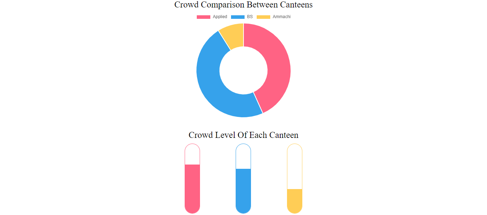
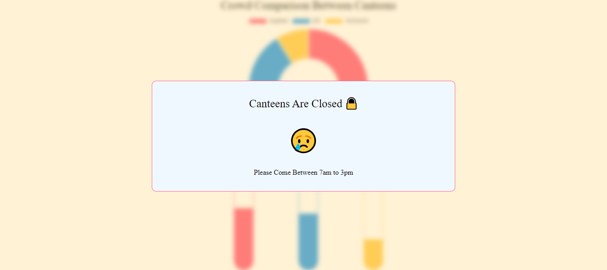

# University Canteen Crowd Analysis and Management Website

## Introduction

This project addresses the issue of overcrowding in the University of Vavuniya's canteens during peak hours. The website provides real-time and static crowd level predictions for the Applied Canteen, BS Canteen, and Ammachi Canteen. The predictions help students make informed decisions about when and where to dine, minimizing wait times and improving their overall dining experience.

## Features

- **Real-Time Crowd Prediction**: Displays crowd levels for each canteen, updated every 5 minutes.
- **Static Data Representation**: Shows hourly percentage of students visiting each canteen in a doughnut chart, updated every hour.
- **Auto-Read Day and Time**: Automatically captures the current day and time to provide relevant data.

## Technologies Used

- **Frontend**: HTML, CSS, JavaScript
- **Data Visualization**: Chart.js

## Setup Requirements

To set up the project locally, ensure you have the following software installed:

- **Git** (for version control)

## Installation Instructions

### Clone the Repository

```bash
git clone https://github.com/jallu-dev/canteen.git
```
## Sample Outputs



